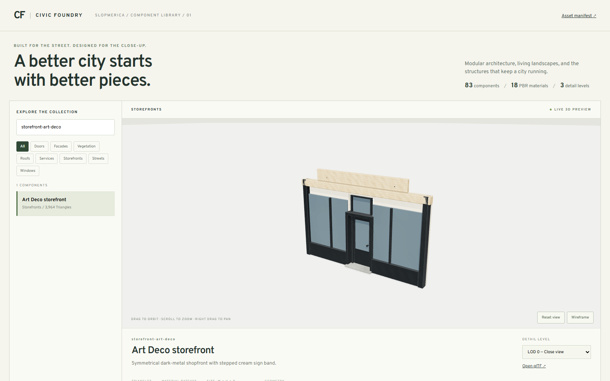
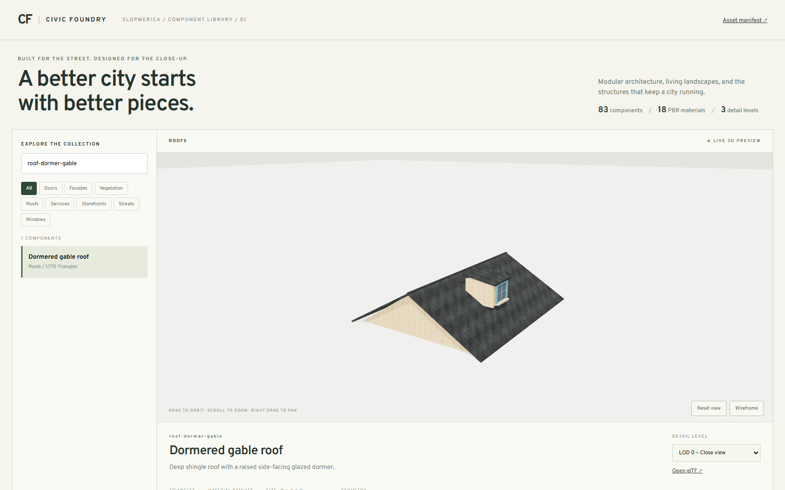
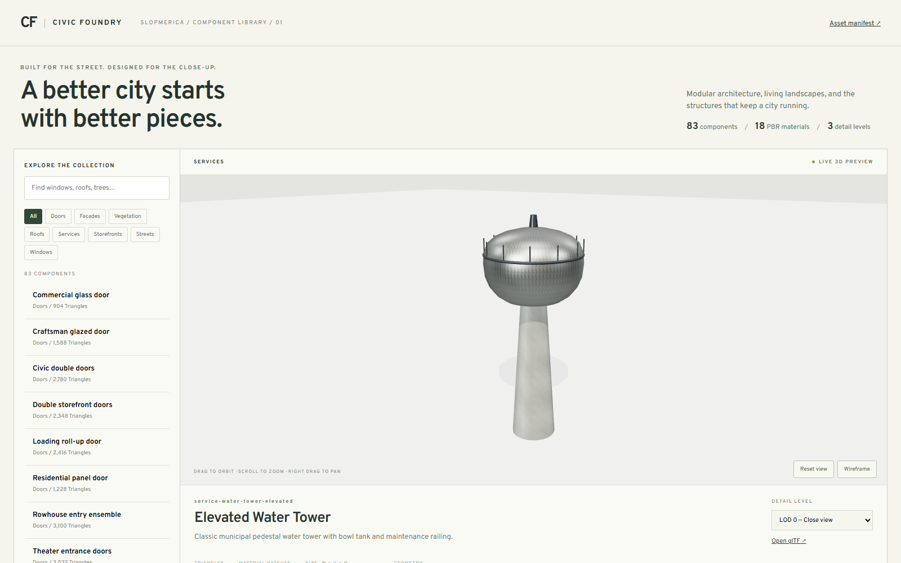
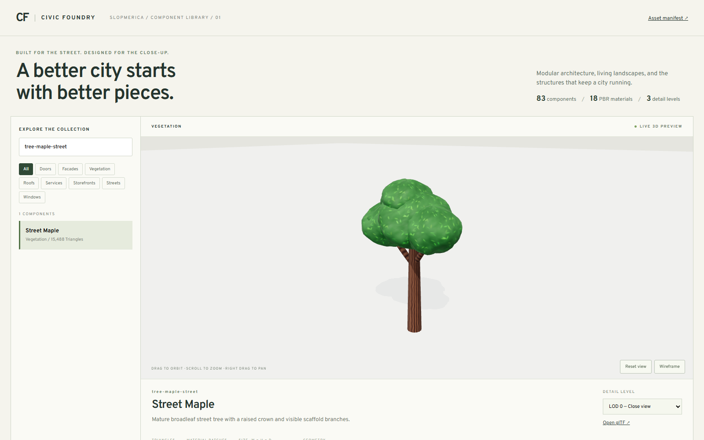

# Civic Foundry asset library

Civic Foundry is SLOPMERICA's standalone collection of original procedural architecture, vegetation, service equipment, and street furniture. The generated distribution is engine-agnostic glTF 2.0: each asset and detail level has a `.gltf` description plus a separate `.bin` geometry buffer, and all models reference the shared PNG material maps in the neighboring `textures` directory.

The current generated manifest is version 1.0.0 and contains 83 assets, 249 glTF models, and 18 PBR materials. The models use 290,894 triangles at LOD0, 41,306 at LOD1, and 11,682 at LOD2; all binary geometry across the three levels is 31.48 MiB.

| Category | Assets | LOD0 triangles | LOD1 triangles | LOD2 triangles |
| --- | ---: | ---: | ---: | ---: |
| Windows | 8 | 13,060 | 1,272 | 300 |
| Doors | 8 | 17,396 | 1,464 | 456 |
| Storefronts | 8 | 37,292 | 3,096 | 1,632 |
| Roofs | 8 | 10,002 | 506 | 266 |
| Facades | 8 | 20,896 | 2,784 | 612 |
| Vegetation | 12 | 103,588 | 15,648 | 3,896 |
| Services | 18 | 50,312 | 10,356 | 2,968 |
| Streets | 13 | 38,348 | 6,180 | 1,552 |

The authoritative inventory is `public/asset-library/manifest.json`. Besides searchable metadata, it records each asset's bounds, dimensions, materials, attachment sockets, LOD URLs, triangle and draw-call counts, binary sizes, and SHA-256 hashes.

## Generate and inspect the library

Install the project's JavaScript dependencies first. Texture generation additionally requires Python with NumPy and Pillow available to the same interpreter used by `npm`:

```sh
python -m pip install numpy Pillow
```

Run the pipeline in this order:

```sh
npm run assets:textures
npm run assets:models
npm run assets:check
```

`assets:textures` writes the 18 deterministic material sets and `materials.json` under `public/asset-library/textures`. The generator uses fixed seeds and periodic sampling; output is byte-stable when run with the same Pillow version. Each material has a 512 × 512 albedo, OpenGL tangent-space normal, and ORM map. ORM channels are red = occlusion, green = roughness, blue = metalness. Albedo is sampled as sRGB; normal and ORM are linear data.

`assets:models` evaluates the procedural definitions, merges each model by material, emits the three glTF levels, and writes `manifest.json`. `assets:check` verifies local file references, hashes, bounds, finite attributes, approximately unit normals, material maps, triangle counts, and LOD ordering.

For the interactive catalog, run:

```sh
npm run assets:dev
```

Then open `http://127.0.0.1:5174/asset-library.html`. To make a static catalog distribution, run:

```sh
npm run assets:build
```

The static result is written to `dist-assets`.

With the dev server running, `npm run assets:browser-check` exercises search,
category filtering, orbit/reset, wireframe, and detail switching, then loads
all 249 variants with the real Three.js loader. Set `CHROME_PATH` to your Chrome
or Chromium executable on platforms other than the default Windows install.
The test uses Vite's development module endpoints and should target the dev
server, not the static preview. Screenshots are written to
`shots/asset-library` (override with `ASSET_LIBRARY_SHOTS`).

## Preview









## Distribution layout

Keep the generated folder structure intact when copying the library:

```text
asset-library/
├── manifest.json
├── README.md
├── models/
│   ├── <asset-id>.lod0.gltf
│   ├── <asset-id>.lod0.bin
│   ├── <asset-id>.lod1.gltf
│   ├── <asset-id>.lod1.bin
│   └── ...
└── textures/
    ├── materials.json
    ├── <material-id>-albedo.png
    ├── <material-id>-normal.png
    ├── <material-id>-orm.png
    └── ...
```

The glTF files use relative references to their `.bin` buffers and to `../textures/*.png`. Moving individual glTF files without those relative files breaks loading. A server must return the JSON, binary, and PNG files; no proprietary runtime format or browser shim is required.

## Coordinates, anchors, and sockets

All dimensions and positions are in metres. +Y is up, +Z is the authored front or street-facing side, and +X is right when looking from the rear toward the front. Asset roots are centered horizontally at their bottom attachment plane.

- Doors, storefronts, facades, service equipment, vegetation, and street pieces normally place their root at finished ground or floor level.
- Window roots sit at the bottom of the sill assembly. Translate the root upward by the desired sill or story height; do not treat the modeled sill as a floor-height offset.
- Roof roots use the eave or building-seat plane at y = 0. Place that plane at the host wall's top elevation.
- Depth can extend on either side of z = 0. Use the manifest bounds when checking wall clearance, setbacks, collisions, and camera framing.

Sockets are named attachment points stored as local-space positions in the manifest. Architecture exposes `wall-anchor` or `building-seat`; service pieces additionally expose connections such as `power`, `water`, `inlet`, `outlet`, `supply`, `return`, `flue`, and conduit endpoints; street pieces expose road, curb, line, deck, and side anchors. Socket records currently contain position only, so attached parts inherit the asset's coordinate convention and the integrating code chooses orientation.

To connect two components, transform both socket positions through their asset roots, rotate the child so its authored +Z faces the intended direction, and translate the child until its matching socket coincides with the host socket. Keep the source root transform available so collision and LOD bounds remain easy to evaluate.

## Runtime loading

The project loader wraps Three.js `GLTFLoader` and validates IDs and LOD availability against the manifest:

```ts
import { CivicLibrary, disposeAsset } from './asset-library/library';

const library = await CivicLibrary.open(
  new URL('/asset-library/', document.baseURI),
);

const storefront = await library.load('storefront-main-street', 1);
scene.add(storefront);

// The caller owns independently loaded scenes.
scene.remove(storefront);
disposeAsset(storefront);
```

`CivicLibrary.open()` fetches `manifest.json`; its default base is `./asset-library/` relative to `document.baseURI`. `load(id, lod)` returns a new `THREE.Group`, enables casting and receiving shadows on its meshes, and records `assetId` and `lod` in `group.userData`. The loader does not select LODs or retain a shared model cache.

Each returned scene is caller-owned. `disposeAsset()` releases geometry, materials, and textures for an independently loaded scene. Clones share GPU resources by default, so do not dispose one clone while another still uses those resources. For repeated placement, load once, keep a reference-counted cache, create instances or clones, and dispose the shared source only after its final consumer is gone.

Other engines can ignore the TypeScript loader and consume the manifest and standard glTF files directly. Honor the declared color spaces and the OpenGL normal-map convention when translating the material description to another renderer.

## LOD and batching guidance

LOD choice should use projected on-screen size, with hysteresis to prevent rapid switching. A useful starting profile based on projected asset height is:

| Projected height | Suggested level |
| --- | --- |
| More than 180 px | LOD0 |
| 60–180 px | LOD1 |
| Less than 60 px | LOD2 |

These values are starting points, not guarantees. Profile them against the target camera, display density, vegetation density, material cost, and frame budget. Architectural hero shots may retain LOD0 longer, while dense tree or service-equipment fields may switch earlier. Add roughly 15–20% hysteresis around each boundary and consider delaying a switch until an asset remains beyond the boundary for several frames.

The exporter produces one primitive per material used by an asset. For repeated city placement, organize render work by material and LOD, then instance identical asset geometry within that group. Avoid mixing different LODs in the same instance batch because their vertex data and bounds differ. A practical cache key is `(asset id, LOD, material primitive)`. Preload or stream the shared material textures once, and retain them across geometry transitions.

LOD0 uses small geometric bevels and more segmented curved parts so light catches window frames, masonry caps, rails, and equipment edges. Lower LODs remove bevels and small parts while retaining recognizable silhouettes. Geometry normals and the normal maps provide the small-scale surface response; roughness and metalness separate masonry, painted wood, glass, galvanized steel, dark metal, copper, and roofing under physically based lighting. Preserve those contrasts with an image-based environment or suitable direct lighting and correct output color management.

## Integrating with the existing SLOPMERICA renderer

The library is ready for integration, but generating it does not automatically replace the game's current building art.

The existing SLOPMERICA building path has two specialized `BatchedMesh` contracts:

1. Zoned buildings and landmarks use non-indexed geometry with position, normal, UV, and vertex-color attributes, one generated atlas and its emissive companion, and a single shared building material.
2. Service and construction Kit geometry is indexed and adds a custom `tile` attribute for a texture-array material.

Civic Foundry glTF assets instead contain standard PBR primitives grouped by material, external albedo/normal/ORM maps, and no legacy `color` or `tile` attribute. They therefore cannot be inserted directly into either existing building batch.

The recommended adapter is a parallel Civic Foundry render path that loads the manifest, caches geometry and material resources, selects LOD by projected bounds, and creates instance batches by asset, material, and LOD. That preserves the authored PBR surfaces and avoids rebaking the library. The adapter should translate gameplay placement into the library's +Y-up, +Z-front roots, connect modular pieces through manifest sockets, participate in atmosphere and shadow settings, and account for its draw calls in the existing performance budgets.

An alternative is an offline conversion step that bakes the Civic Foundry surfaces into the existing atlas or texture array and emits the exact legacy attributes and indexing form. That route can preserve the current one-material batching strategy, but it discards some authored material separation and requires explicit treatment of glass, normal maps, ORM channels, emissive behavior, and metre-space tiling. Whichever path is chosen, validate a mixed street scene before changing the default building generator.

## Authorship and use

This first collection uses solid modeled canopy masses and opaque reflective
glazing. Leaf-card vegetation, transparent interiors, emissive night-window
variants, collision meshes, and automatic in-game placement are not included.
The high-detail trees reach about 18,000 triangles; use the reduced levels and
instancing for city-scale coverage. The library does not establish a measured
in-game graphics or frame-rate improvement until its renderer adapter is built.

The models and textures are original procedural assets authored for this repository. They do not contain downloaded models or third-party art. That provenance statement does not grant a separate license; use and redistribution remain governed by the repository's applicable license and project terms.
