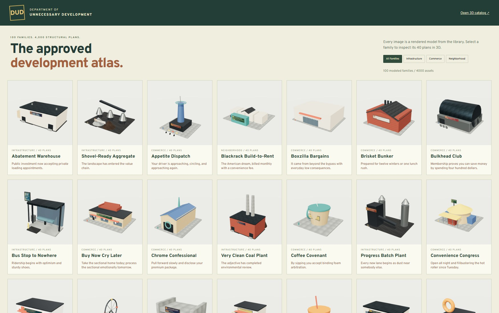

# SLOPMERICA Asset Vault

The Asset Vault is a separate library of **4,000 additional original assets** for future SLOPMERICA work. It contains 100 modeled families with 40 structural variants per family:

| Category | Families | Assets |
| --- | ---: | ---: |
| Commerce | 35 | 1,400 |
| Infrastructure | 35 | 1,400 |
| Neighborhood | 30 | 1,200 |
| **Total** | **100** | **4,000** |

Each asset file contains three LOD scenes, for 12,000 LOD scenes total. Those scenes are alternate representations of the same 4,000 assets; they are not counted as additional assets.



The generated [family thumbnails](../vault-public/asset-vault/thumbnails/) contain one rendered representative for each of the 100 families. They are review aids rather than additional assets. Browse the visual atlas at `asset-vault-overview.html`, or inspect the full category sheets: [commerce](assets/vault-commerce.jpg), [infrastructure](assets/vault-infrastructure.jpg), and [neighborhood](assets/vault-neighborhood.jpg).

## Scope and branch isolation

This work was created on a new branch from the base game. It uses new Asset Vault paths and leaves the existing PR6 implementation untouched. It does not register new buildings, services, zones, collisions, or simulation behavior in the normal game.

Generated content lives under `vault-public/asset-vault`, deliberately outside the game's normal `public` directory. `vite.vault.config.ts` points its isolated catalog at `vault-public`; the normal game build therefore does not copy the full library. The isolated static catalog build writes to `dist/asset-vault`, which is covered by the repository's existing `dist/` ignore rule.

`package.json` is unchanged. The commands below are direct commands, not `npm run` scripts.

## What “4,000 assets” means

The collection has 100 original parametric family designs. Every family produces 40 models through a fixed **5 sizes × 4 layouts × 2 states** matrix. Size changes footprint and massing; layout changes arrangements, wings, sides, or equipment; state adds or changes structural scene content. Variants are not palette swaps or renamed copies.

The collection is procedurally authored. It is not 4,000 individually hand-modeled sculptures, and the five sizes should not be described as five separately art-directed models. The design system intentionally gives each family creative freedom in silhouette, signage, props, and satire while retaining a common low-poly visual language.

The build records one `geometrySignature` per asset. It hashes serialized position/index references and transforms for the modeled structure while excluding generated signs and generic base/foundation/lot/slab pieces. The build rejects duplicate structural signatures. A unique signature establishes that geometry or transforms differ; it is an integrity check, not a claim about artistic quality.

Representative metadata illustrates the intended voice:

- **Boxzilla Bargains:** “A retail monster that feeds on little downtowns.” Its satire line is “It came from beyond the bypass with everyday low consequences.”
- **Mattress Mitosis:** “One bedding store divides into two when nobody is looking.” Scientists still cannot locate a customer.
- **Frankenpine Cell Tower:** “A cellular mast wearing increasingly unconvincing fake branches.” It preserves the viewshed one plastic needle at a time.
- **One-Bus Depot:** an oversized depot sheltering the county's heroic hourly bus, with capacity of one vehicle and a press release.
- **Last Hellbender Memorial Lot:** a salamander monument centered on commemorative parking; the species lost its creek but gained eight convenient spaces.
- **Mount Trashmore Regional Park:** a capped landfill landscaped into a switchback hill, turning yesterday's trash into today's scenic methane overlook.

All brands and signs in this collection are fictional. No real logos are included.

## Rebuild and validation

See [the verification record](ASSET_VAULT_QA.md) for the completed checks, measured inventory, and practical limits.

The texture and sign generators require Python with NumPy and Pillow 10.1 or newer. Generation is deterministic with the same toolchain; font rasterization can differ between Pillow versions. Run these commands from the repository root in this order:

```sh
python scripts/asset-vault/textures.py
node scripts/asset-vault/build.mjs
python scripts/asset-vault/signs.py
node scripts/asset-vault/validate.mjs
```

The order matters: the model build reads `textures/materials.json`, and the sign generator reads the `families.json` produced by the model build.

`validate.mjs` is the authoritative static integrity pass. It checks all 4,000 glTF files and 12,000 scenes, file and shared-buffer hashes, path containment, binary accessor ranges and types, finite geometry, unit normals, indices, transforms, computed bounds, LOD counts, LOD triangle monotonicity, structural signatures, 54 material maps, and 100 sign atlases.

Run the catalog locally in one terminal:

```sh
npx vite --config vite.vault.config.ts
```

Open [http://127.0.0.1:5176/asset-vault.html](http://127.0.0.1:5176/asset-vault.html). The browser validator expects that server to remain running. Its full-load and thumbnail modes are intentionally separate:

```sh
node scripts/asset-vault/browser-check.mjs --full
node scripts/asset-vault/browser-check.mjs --thumbnails
```

Set `CHROME_PATH` to a Chromium-compatible executable if Chrome or Edge is not installed in a standard location. `--full` loads and disposes all 4,000 assets at all three LODs, one family page at a time. `--thumbnails` renders variant 0 of each family to `vault-public/asset-vault/thumbnails`.

After creating new public files while Vite is running, restart the server before opening the atlas so its public-file inventory refreshes. Generated folders are excluded from the development watcher to avoid reloading the viewer during batch rendering. Run `node scripts/asset-vault/overview-check.mjs` to verify atlas filters, all preview images, the mobile layout, and links back into the 3D catalog; it also refreshes the category contact sheets.

Build the isolated static catalog with:

```sh
npx vite build --config vite.vault.config.ts
```

The output is `dist/asset-vault`. This command does not alter the normal game Vite configuration.

## File layout

```text
asset-vault.html                    isolated catalog entry
asset-vault-overview.html           visual atlas with all 100 family previews
vite.vault.config.ts               catalog-only Vite configuration
src/asset-vault/
  catalog.ts                       searchable 3D catalog UI
  catalog.css
  library.ts                       small runtime loading API
  overview.ts / overview.css        category-filtered family atlas
scripts/asset-vault/
  kit.mjs                          procedural geometry/material kit
  commercial.mjs                   35 commerce families
  infrastructure.mjs               35 infrastructure families
  neighborhood.mjs                 30 neighborhood families
  textures.py                      deterministic PBR texture generator
  build.mjs                        glTF/manifest/catalog exporter
  signs.py                         deterministic sign atlas generator
  validate.mjs                     static integrity validator
  browser-check.mjs                browser load/disposal and catalog checks
  overview-check.mjs               atlas checks and category screenshots
  export-glb.mjs                   portable single-asset exporter
vault-public/asset-vault/
  manifest.json                    machine-readable library index
  families.json                    family metadata
  catalog.csv                      searchable 4,000-row flat catalog
  models/                          4,000 glTF documents
  shared/geometry.bin              shared 15.67 MiB geometry buffer
  textures/                        18 PBR material sets
  signs/                           100 sign atlases
  thumbnails/                      100 generated family preview images
```

## Asset and material format

Each file under `models/` is glTF 2.0 JSON with one external buffer reference to `../shared/geometry.bin`. It contains three named scenes:

| Scene | Meaning | Suggested use |
| ---: | --- | --- |
| 0 | LOD 0 | Close inspection and hero placement |
| 1 | LOD 1 | Street-scale viewing |
| 2 | LOD 2 | City-scale silhouette |

The shared binary buffer is 16,435,520 bytes (15.67 MiB). Keeping geometry external avoids duplicating the same attribute blocks across 4,000 documents. Copying or serving an individual `.gltf` without the shared buffer and its images will produce an incomplete asset; use the GLB exporter when a self-contained file is needed.

The material library contains 18 procedural PBR material sets. Each set has a 512 × 512 albedo, OpenGL +Y normal, and ORM map, for 54 maps total. ORM channels are red = ambient occlusion, green = roughness, and blue = metalness. Six additional paint materials use solid PBR colors. There are 100 sign atlases at 2048 × 2048; each atlas contains 40 labeled 512 × 200 regions, one per structural plan, for 4,000 sign regions total.

Models use metres, +Y up, and +Z as the street-facing front. The root origin is the ground anchor. Dimensions and bounds include visible signs and props, so they are suitable for placement clearance but may exceed the main building footprint.

Every manifest asset includes two position-only sockets:

- `ground-anchor` at `[0, 0, 0]`
- `street-front` at `[0, 0, bounds.max[2]]`

Sockets currently have no orientation, lane, door, utility, or gameplay semantics. They do not register an asset with the game. Bounds can seed a placeholder collision or placement envelope, but the library does not include authored gameplay colliders.

## Runtime API

`src/asset-vault/library.ts` exposes `VaultLibrary` and `VaultHandle`:

```ts
import { VaultLibrary } from './asset-vault/library';

const vault = await VaultLibrary.open();
const handle = await vault.load('vlt-boxzilla-bargains-01', 1);
scene.add(handle.root);

handle.setLOD(2);

scene.remove(handle.root);
handle.dispose();
```

`VaultLibrary.open(base?)` loads the manifest and builds an ID index. Its default base is `./asset-vault/` relative to the document. `load(id, lod)` loads one glTF, returns a handle, attaches the selected scene to `handle.root`, and exposes the manifest record as `handle.asset`. `setLOD(0 | 1 | 2)` swaps the scene under that root.

GLTFLoader loads and parses all three scenes before `load` resolves, even when the initial selected LOD is 1 or 2. `dispose()` clears the root and disposes geometry, textures, and materials across all scenes in that handle. Treat those resources as handle-owned. A clone that shares them must remain co-owned with the handle and must not outlive or independently dispose them. For long-lived shared instances, introduce an explicit reference-counted cache first.

CPU-side URL caching is opt-in. The catalog enables `THREE.Cache` for its isolated review workload; `VaultLibrary` does not change Three.js global cache behavior for a host application.

## Portable GLB export

Export one selected LOD with embedded geometry and PNG images:

```sh
node scripts/asset-vault/export-glb.mjs --id vlt-boxzilla-bargains-01 --lod 0
```

The exact interface is:

```text
node scripts/asset-vault/export-glb.mjs --id <asset-id> --lod <0|1|2> [--out <file.glb>] [--force]
```

Without `--out`, the exporter writes `work/<asset-id>-lod<lod>.glb`. It refuses to overwrite an existing file unless `--force` is supplied. The resulting GLB contains only the selected LOD and is self-contained.

## Rendering and performance guidance

These models preserve separate semantic parts for readability and variation. An asset's manifest `drawCalls` is therefore approximately its mesh-node cost; the files are not baked into one draw call. Loading many untouched handles directly is appropriate for catalog inspection, not a city-scale production renderer.

For game integration:

- Use projected screen height as the first LOD signal: LOD 0 above roughly 180 px, LOD 1 from roughly 80–180 px, and LOD 2 below roughly 80 px.
- Add hysteresis so camera motion does not flap between scenes.
- Treat LOD 0 as a capped high-detail budget. A conservative starting point is 24 simultaneous LOD 0 assets, then profile representative towns on target hardware.
- Instance repeated family/variant/LOD combinations. For heterogeneous blocks, merge compatible geometry by material and cache the merged result per chunk.
- Share decoded textures and materials through an ownership-aware cache. Do not combine library-handle disposal with unmanaged resource sharing.
- Stream by district or visible chunk rather than opening thousands of glTF files at startup.

The thresholds and budget are starting suggestions, not measured game limits. In-game performance has not been established.

## Metadata and search

`manifest.json` is the canonical machine-readable index. `families.json` contains the 100 family records. `catalog.csv` contains all 4,000 asset rows with IDs, category, plan, satire, dimensions, per-LOD triangle counts, and glTF path. The catalog searches IDs, labels, descriptions, satire, and tags.

The variant plan code is `<layout><size>-<state>`: layouts `A`–`D`, sizes `1`–`5`, and states `1`–`2`. For example, `C4-2` is layout 3, size 4, state 2. Asset IDs use one-based, zero-padded variant suffixes (`-01` through `-40`), while the manifest's `variant` field is zero-based (`0` through `39`).

## Known art limitations

- Glass is a solid blue-gray PBR surface. There are no transparent interiors, refraction, furnished rooms, or nighttime interior volumes.
- Canopies, roofs, signs, vegetation, vehicles, and equipment favor readable low-poly masses over fabrication detail.
- The collection has no individual human sculpting pass for every variant. Procedural consistency is a strength, but repeated construction grammar remains visible.
- Sign typography is generated from a portable bundled/default font treatment rather than individually lettered brand art.
- Bounds include signs and props and are not precise collision hulls.
- Geometry uniqueness does not prove composition quality, accessibility, gameplay usefulness, or performance in a populated simulation.

## In the game

Since the merge into the game branch, the vault is wired in (`src/vault/`, packed by `scripts/vault-pack.mjs`):

- All 4,000 assets' LOD 1 scenes are packed into `public/vault` as a shared shape library plus one quantized record per part (ground pads dropped), about 2 MiB.
- Each asset is built as an ordinary game building through the MeshBuilder, with the game's atlas tiles standing in for the vault's PBR materials and a per-family sign on the satire sheet that glows at night. Glass lights up at night; flat glass is drawn as water.
- Zoned lots grow vault buildings in extra variant slots when an asset fits the lot (shrunk to no less than 80%, never enlarged): commerce on commercial lots, homes on residential lots, yards on industry, civic offices on office lots. SLOP merch brands keep their lots.
- 16 neighborhood families are roadside attractions in Services > Parks (park coverage, cost, upkeep, unlocks).
- 11 infrastructure and commerce families are the looks of the matching city services (gas peaker, coal plant, solar farm, pump, water tower, outfall, treatment plant, firehouse, sheriff, urgent care, hospital), using the plan that fills the service's lot best (enlarged up to 1.8x); their stacks carry the game's smoke emitters. Services > Looks switches between these and the classic models, live.
- `scripts/vaulttest.mjs` checks all of it, including the fallback without the pack.

What's still open from the list below: the road and transit families (toll plaza, express-lane gantry, pedestrian overpass, culvert gateway, bus stop to nowhere, transit token kiosk, one-bus depot, grid substation, fiber hut, cell tower, retention pond office) aren't placed, the game uses one LOD, and there's no per-building choice of plan beyond the lot fit.

## Integration work still required

The vault started as an art library and catalog. The list below was the full integration scope; see "In the game" above for what has been done:

- building/service definitions, zoning rules, costs, unlocks, demand, and simulation registration;
- parcel fit, road frontage, door/driveway lanes, terrain grading, utilities, and placement validation;
- collision/nav meshes and interaction anchors beyond the two position-only sockets;
- renderer-side instancing or per-material merging, shared-resource ownership, streaming, and an in-game LOD controller;
- an adapter from the vault's standalone PBR materials/sign atlases to the game's atlas and emissive/night-light pipeline;
- optional transparent glass, interiors, emissive signs, damage/season/state art, and animation;
- representative in-game performance measurement and memory budgets on target hardware.

The in-game integration above is measured by `scripts/vaulttest.mjs`; it has not been performance-certified on target hardware.

## Complete family inventory

### Commerce — 35 families / 1,400 assets

| ID | Family | Variants |
| --- | --- | ---: |
| `appetite-dispatch` | Appetite Dispatch | 40 |
| `boxzilla-bargains` | Boxzilla Bargains | 40 |
| `brisket-bunker` | Brisket Bunker | 40 |
| `bulkhead-club` | Bulkhead Club | 40 |
| `buy-now-cry-later` | Buy Now Cry Later | 40 |
| `chrome-confessional` | Chrome Confessional | 40 |
| `coffee-covenant` | Coffee Covenant | 40 |
| `convenience-congress` | Convenience Congress | 40 |
| `copay-castle` | Copay Castle | 40 |
| `curb-crave` | Curb Crave | 40 |
| `daiquiri-dash` | Daiquiri Dash | 40 |
| `donut-deposition` | Donut Deposition | 40 |
| `forever-box-storage` | Forever Box Storage | 40 |
| `gas-guzzler-gulch` | Gas Guzzler Gulch | 40 |
| `ghost-kitchen-carousel` | Ghost Kitchen Carousel | 40 |
| `lane-lord-burgers` | Lane Lord Burgers | 40 |
| `lease-eagle-motors` | Lease Eagle Motors | 40 |
| `loyalty-lab` | Loyalty Lab | 40 |
| `mattress-mitosis` | Mattress Mitosis | 40 |
| `octane-oasis` | Octane Oasis | 40 |
| `parcel-panic` | Parcel Panic | 40 |
| `payday-patriot` | Payday Patriot | 40 |
| `popup-afterlife` | Popup Afterlife | 40 |
| `porch-pirate-proof` | Porch Pirate Proof | 40 |
| `premium-denied` | Premium Denied | 40 |
| `rent-a-life` | Rent A Life | 40 |
| `repo-ranch` | Repo Ranch | 40 |
| `return-to-sender-outlet` | Return to Sender Outlet | 40 |
| `smile-finance` | Smile Finance | 40 |
| `strip-mall-of-duty` | Strip Mall of Duty | 40 |
| `subscription-station` | Subscription Station | 40 |
| `tractor-therapy` | Tractor Therapy | 40 |
| `waffle-index` | Waffle Index | 40 |
| `wallet-er` | Wallet ER | 40 |
| `wash-n-worship` | Wash N Worship | 40 |

### Infrastructure — 35 families / 1,400 assets

| ID | Family | Variants |
| --- | --- | ---: |
| `abatement-warehouse` | Abatement Warehouse | 40 |
| `pump-station` | Artesian-ish Pump Station | 40 |
| `wind-service-yard` | Breeze Compliance Yard | 40 |
| `fiber-hut` | Broadband Promise Hut | 40 |
| `bus-stop-nowhere` | Bus Stop to Nowhere | 40 |
| `water-tower` | County Water Tower | 40 |
| `culvert-gateway` | Culvert Gateway | 40 |
| `dmv-queue-annex` | DMV Queue Annex | 40 |
| `express-lane-gantry` | Express Lane Gantry | 40 |
| `frankenpine-cell-tower` | Frankenpine Cell Tower | 40 |
| `solar-farm` | Freedom Solar Farm | 40 |
| `fulfillment-center` | Fulfillmore Center | 40 |
| `self-storage-complex` | Future Downtown Storage | 40 |
| `grid-substation` | Independent Grid Substation | 40 |
| `gas-peaker-plant` | Last-Minute Gas Peaker | 40 |
| `road-construction-yard` | One More Lane Yard | 40 |
| `one-bus-depot` | One-Bus Depot | 40 |
| `sewage-outfall` | Outfall Opportunity | 40 |
| `parking-minimums-garage` | Parking Minimums Garage | 40 |
| `pedestrian-overpass` | Pedestrian Overpass | 40 |
| `permit-palace` | Permit Palace | 40 |
| `wastewater-plant` | Poop Palace Treatment | 40 |
| `concrete-batch-plant` | Progress Batch Plant | 40 |
| `public-works-yard` | Public Works Yard | 40 |
| `retention-pond-office` | Retention Pond Office | 40 |
| `sheriff-substation` | Sheriff Substation | 40 |
| `aggregate-loader` | Shovel-Ready Aggregate | 40 |
| `surface-parking-empire` | Surface Parking Empire | 40 |
| `tax-assessor-bunker` | Tax Assessor Bunker | 40 |
| `tollbooth-plaza` | Tollbooth Plaza | 40 |
| `transit-token-kiosk` | Transit Token Kiosk | 40 |
| `clean-coal-plant` | Very Clean Coal Plant | 40 |
| `volunteer-firehouse` | Volunteer Firehouse | 40 |
| `recycling-transfer-station` | Wishcycling Transfer Station | 40 |
| `zoning-hearing-hall` | Zoning Hearing Hall | 40 |

### Neighborhood — 30 families / 1,200 assets

| ID | Family | Variants |
| --- | --- | ---: |
| `blackrack-rentals` | Blackrack Build-to-Rent | 40 |
| `hostile-bench-plaza` | Civic Comfort Plaza | 40 |
| `double-wide` | Double-Wide Executive | 40 |
| `five-acre-ranchette` | Five-Acre Ranchette | 40 |
| `golf-cart-village` | Forever Young Golf-Cart Village | 40 |
| `freedom-splash-pad` | Freedom Splash Pad | 40 |
| `gated-golf-estate` | Gated Golf Estates | 40 |
| `gather-farmhouse` | GATHER Modern Farmhouse | 40 |
| `holler-cabin` | Holler Cabin Compound | 40 |
| `lake-serenity-pond` | Lake Serenity Retention Pond | 40 |
| `last-hellbender-memorial` | Last Hellbender Memorial Lot | 40 |
| `liberty-barndominium` | Liberty Barndominium | 40 |
| `liberty-muffler-man` | Liberty Muffler Man | 40 |
| `mandatory-hoa-gate` | Mandatory HOA Gate | 40 |
| `miracle-twine-ball` | Miracle Twine Ball | 40 |
| `mount-trashmore` | Mount Trashmore Regional Park | 40 |
| `county-fair-midway` | Possum County Midway | 40 |
| `prepper-compound` | Prepared Acres Compound | 40 |
| `seven-gables-mcmansion` | Seven Gables McMansion | 40 |
| `sidewalk-to-nowhere` | Sidewalk to Nowhere | 40 |
| `single-wide` | Single-Wide Freedom Home | 40 |
| `pocket-park` | Six-Lane Pocket Park | 40 |
| `suburban-history-museum` | Suburban History Museum | 40 |
| `tract-ashford` | The Ashford | 40 |
| `tract-beaumont` | The Beaumont | 40 |
| `tract-carrington` | The Carrington | 40 |
| `frankenpine-memorial` | The Last Tree Frankenpine | 40 |
| `roadside-cross` | Two-Hundred-Foot Roadside Cross | 40 |
| `whispering-pines` | Whispering Pines Estates | 40 |
| `worlds-largest-fork` | World's Largest Fork | 40 |

## Rights and redistribution

This document does not grant a license or redistribution rights. Determine the repository's applicable terms before copying or distributing the source or generated assets.
