# AA world pass: visual QA and performance

The commune images compare the base commune rebuild (`f5a8dbe`) with this branch at the same Appalachia camp, camera distance, time, and weather. The final branch was also captured on NorCal and Florida at 15, 40, and 150 m in day, night, rain, and snow; all 36 final captures completed without browser, console, or shader errors.

| View | Before | After |
| --- | --- | --- |
| Day, 15 m | 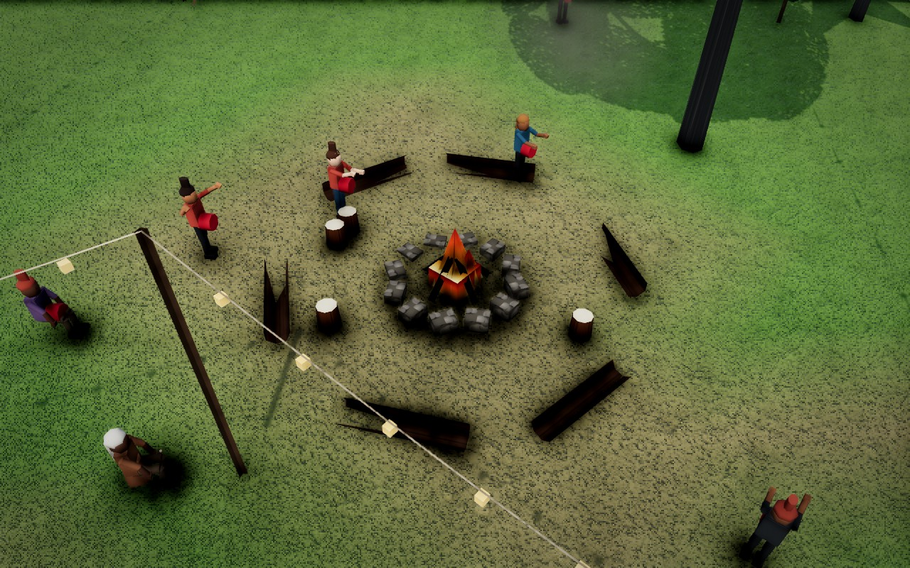 | 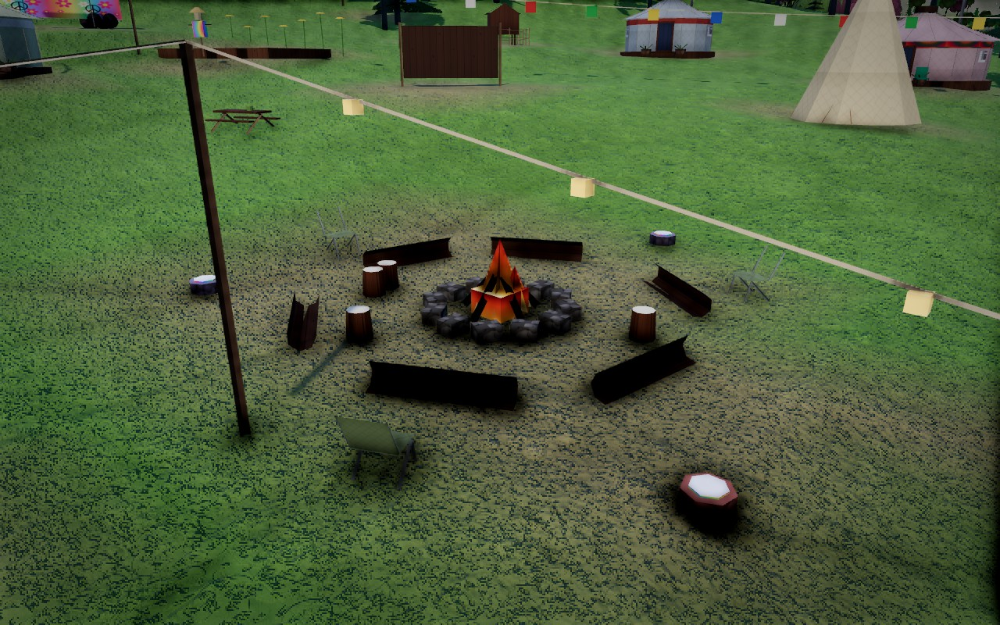 |
| Day, 40 m | 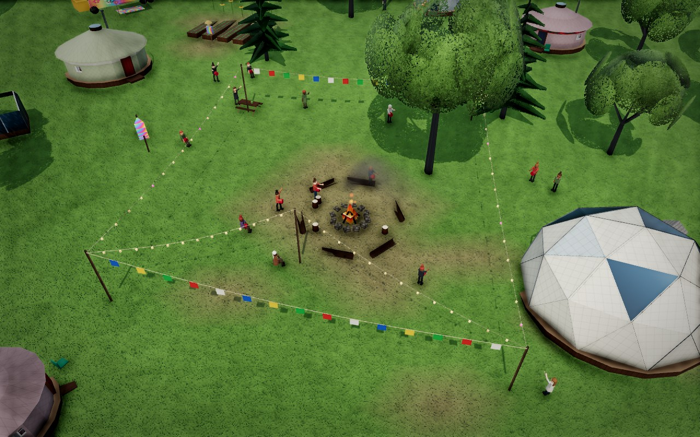 | 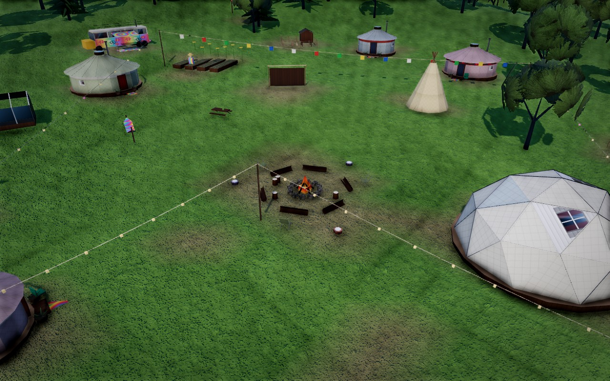 |
| Day, 150 m | 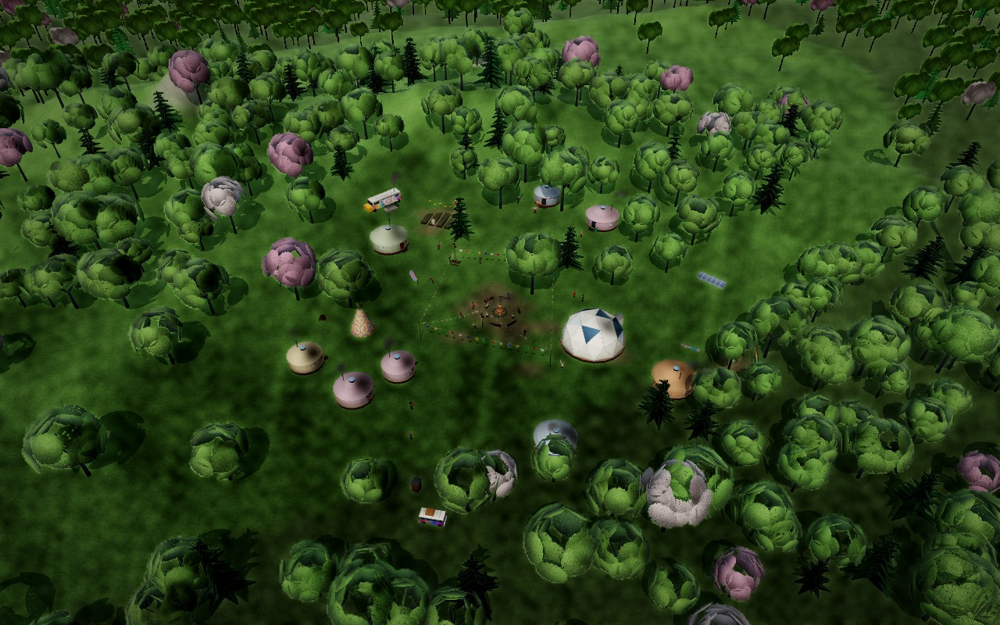 | 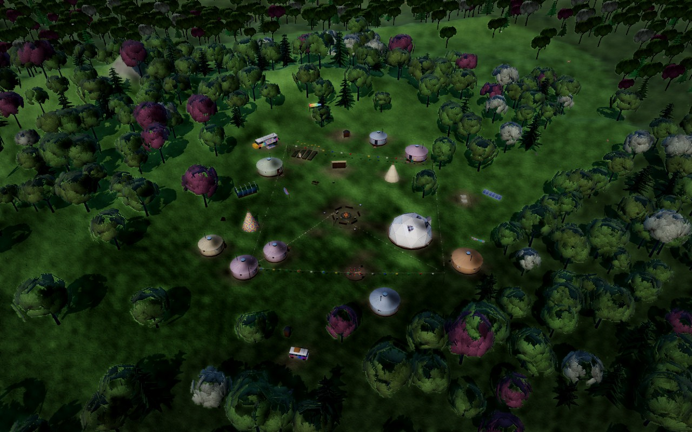 |
| Night, 40 m | 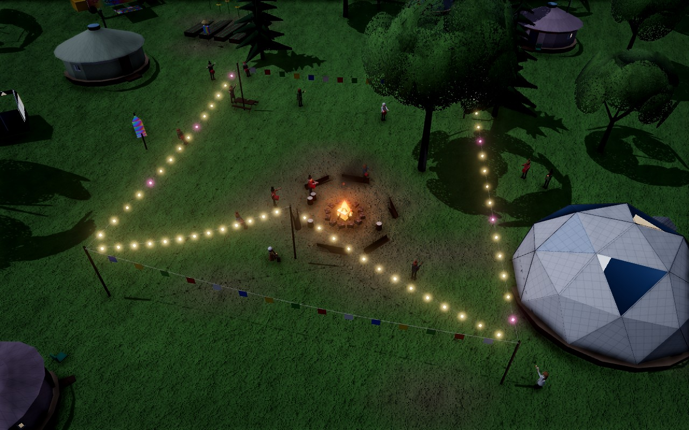 | 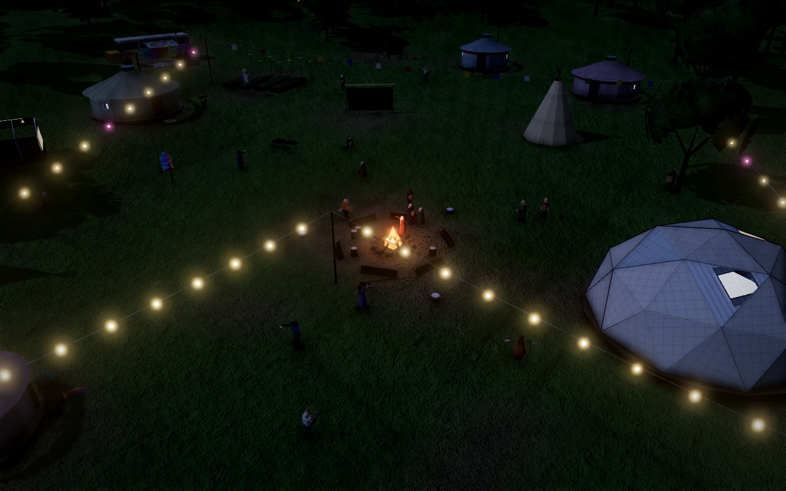 |
| Rain, 40 m | 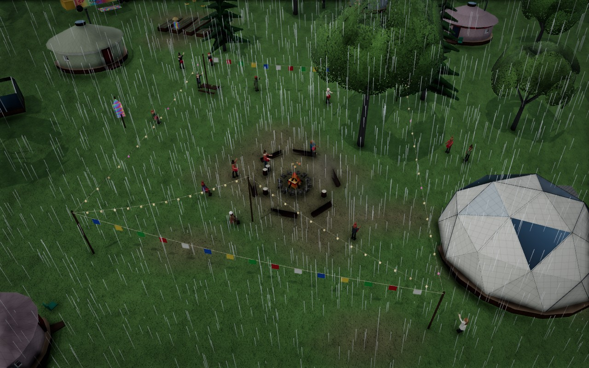 | 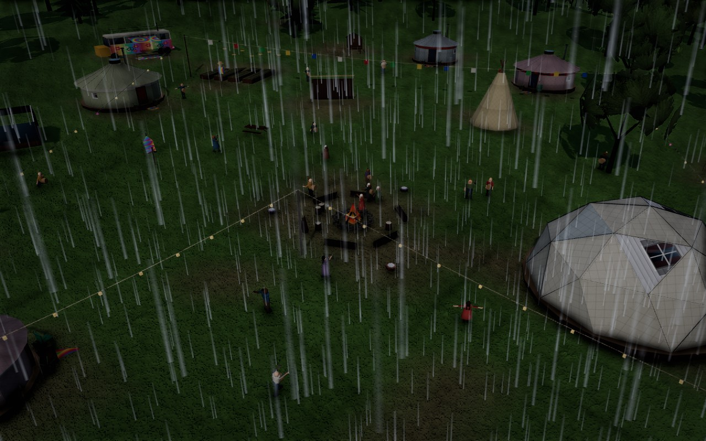 |
| Snow, 40 m | 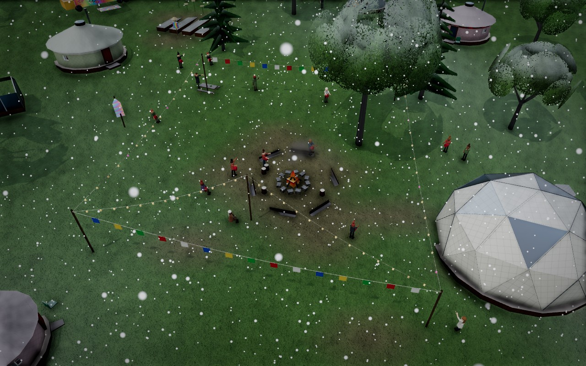 | 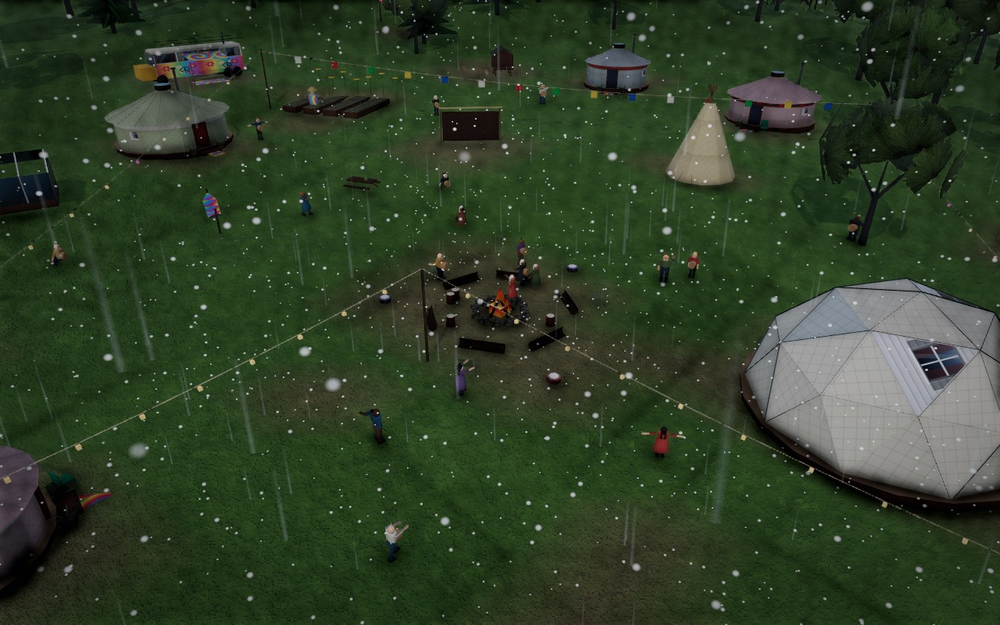 |

Additional final views: [NorCal day](qa/norcal-after-day-40.jpg), [Florida night](qa/florida-after-night-40.jpg), [signalized street by day](qa/street-signal-day.jpg), [signalized street at night](qa/street-signal-night.jpg), and [commune remains after departure](qa/commune-burnt-remains.jpg).

## Large town performance

The repeatable harness in `scripts/perfTown.mjs` builds a dry 7 × 7 road grid, zones it, advances 270 simulation days, waits at least 20 seconds for dynamic resolution to settle, and collects 30 frame samples. Measurements below are from Chrome 153 using **ANGLE D3D11 on an AMD Radeon 860M** in the Ryzen AI 7 350 laptop, not SwiftShader. Both runs reached full preset resolution. Browser FPS is uncapped. The simulated towns vary slightly between runs because citizen and traffic events are random.

| Preset and viewport | Town | FPS | Mean frame | Work | Draw calls | Triangles | Resolution |
| --- | ---: | ---: | ---: | ---: | ---: | ---: | ---: |
| High, 1280 × 800 | 199 buildings, 8,083 people | 71.1 | 14.1 ms | 6.4 ms | 147 | 3,418,476 | 100% |
| Low, 390 × 844 | 184 buildings, 7,122 people | 168.7 | 5.9 ms | 3.8 ms | 112 | 1,165,694 | 100% |

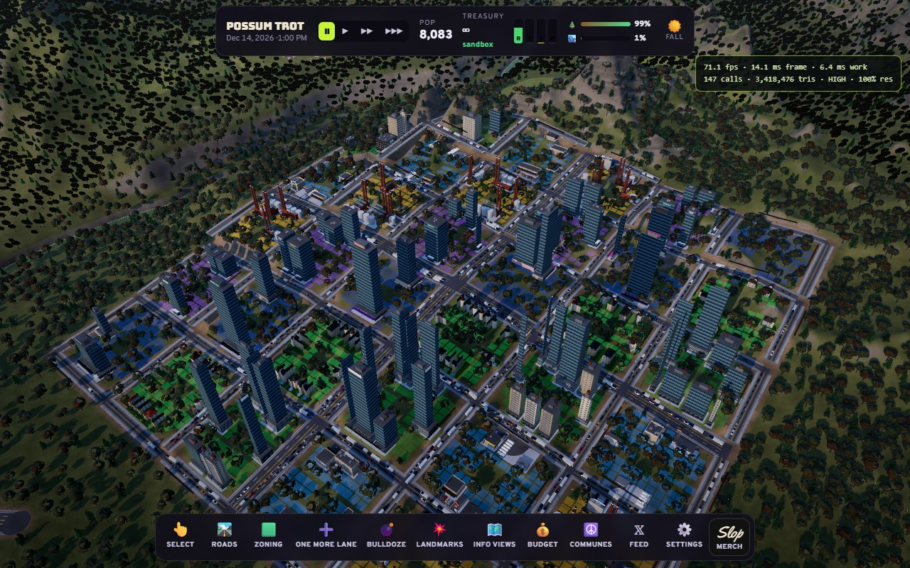
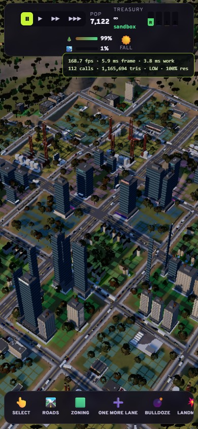

Unobstructed game captures: [High town](qa/town-high.jpg) and [Low town](qa/town-low.jpg).

The measured scene costs addressed in this pass were:

1. A distant water tile caused a second scene render in a dry town view. Visibility and distance culling eliminated **186 draw calls and about 2.35 million triangles** in that comparison, while retaining planar reflections around nearby water. The final dry-town profile confirms that toggling reflection off saves no additional calls.
2. Ground-detail placement previously took 3.4 ms median and up to 9.3 ms in a dense town. The incremental refill now measured **0.6 ms median and 0.9 ms maximum** per frame in the final High town run; Low stayed at or below 0.6 ms.
3. Distant commune fires were adding point lights to the scene. Their light is now active only near the camera; distant flame and bulb geometry remains visible.
4. The building geometry kit now shares quad corners. The High town uses **188,102 stored building vertices** (199 buildings) and the Low town uses **163,508** (184 buildings), with the same rendered triangles and visual detail. A deterministic 10,800-building generation matrix measured a 32.8% drop in stored vertices.

An interleaved GPU timer profile measured about 7.55 ms for a rendered High frame at 60% scale. The largest remaining GPU costs in this view were trees (2.57 ms), the complete post pass (2.49 ms; AO alone was 0.08 ms), and shadows (1.52 ms). A contended concurrent-browser run briefly measured 47.9 FPS and scaled to 60%; exclusive hardware runs measured 72.4, 72.3, 72.2, and 71.1 FPS at 100% scale. The last run fixes the weather to clear and includes the compact street junction geometry; it is the representative result above.

`scripts/touchtest.mjs` passed at 390 × 844 on Low after the atmosphere merge: the drag created four road segments, Done ended drawing, and Undo restored the original segment count. The departure test confirmed `gone` state, attached burnt remains, scorched terrain paint, and no browser errors. The final 36-view commune matrix across all three maps, plus the latest street and departure captures, had no browser or shader errors. Cold High boots in the atmosphere lab on Appalachia and Florida had no WebGL, shader, or program-link errors after correcting reflection render order. TypeScript and the single-file build passed before the branch push.
